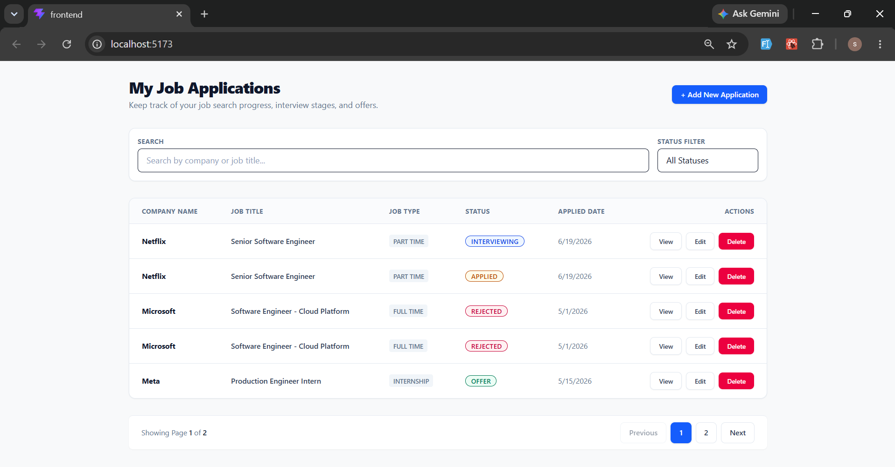
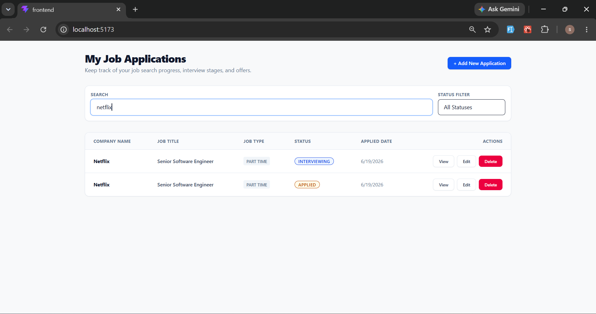
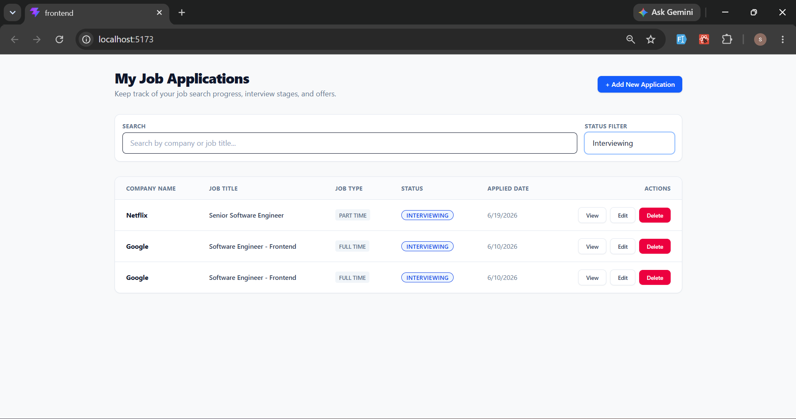
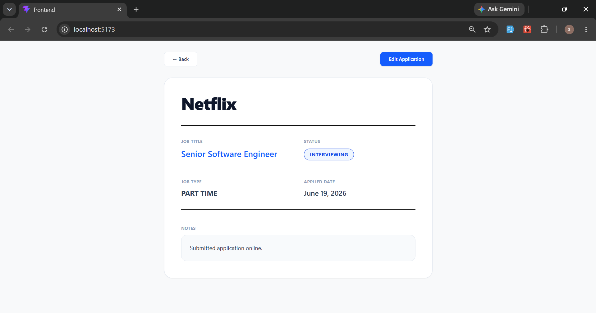
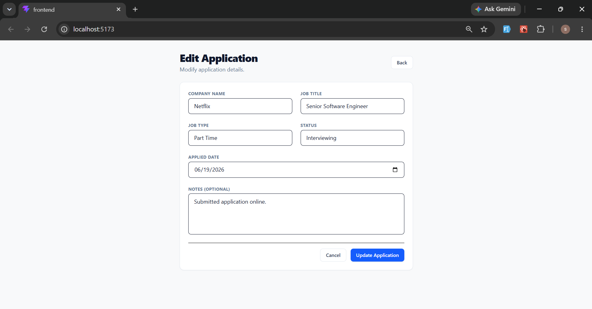
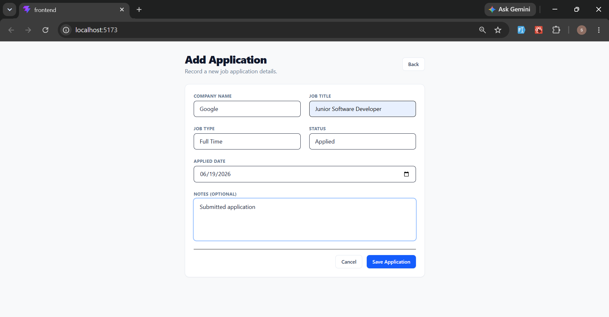
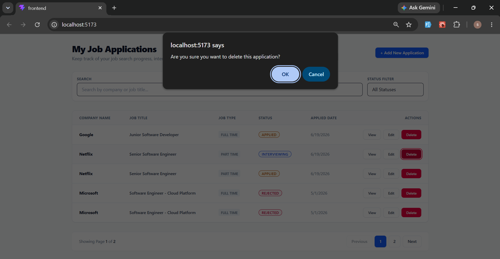

# Job Application Tracker

A simple, modern, full-stack Job Application Tracker designed as an internship assignment codebase. It enables users to record, update, filter, and delete their job search entries in a clean, responsive single-page dashboard.

## 🔗 Live Demo
* **Frontend Application**: [https://mini-job-tracker-delta.vercel.app/](https://mini-job-tracker-delta.vercel.app/)
* **Backend API**: [https://minijobtracker.onrender.com](https://minijobtracker.onrender.com)

## Tech Stack
* **Backend**: Node.js, Express, TypeScript, PostgreSQL, Prisma ORM, Zod
* **Frontend**: React (Vite), TypeScript, Tailwind CSS v4

---

## Application Walkthrough & Screenshots

Here is a quick look at the interface and core features of the app:

### 1. Main Dashboard
The home screen lists all your job applications in a clean, modern table. Statuses like `Applied`, `Interviewing`, `Offer`, or `Rejected` are clearly color-coded for quick scanning.


### 2. Searching & Filtering
* **Search**: Instantly filter down your list by typing the company name or job title.
  
* **Status Filter**: Toggle between statuses to view only your active interviews, received offers, etc.
  

### 3. Viewing & Editing Details
* **Detail Page**: A spacious, focused view of a single application to read your notes and check the dates.
  
* **Edit Screen**: Update your notes, change status, or edit application info as you move along the hiring pipeline.
  

### 4. Creating & Deleting Entries
* **Add Application**: A simple, validated form to quickly log a new application.
  
* **Delete Flow**: Clean confirmation prompt before permanently removing an entry.
  

---

## Folder Structure
```
JobTracker/
├── backend/                  # Node.js + Express backend
│   ├── prisma/               # Prisma schema and migrations
│   │   └── schema.prisma
│   ├── src/
│   │   ├── controllers/      # Route controllers
│   │   ├── routes/           # Express routes
│   │   ├── validation/       # Zod schemas for request validation
│   │   ├── app.ts            # Express app setup
│   │   ├── prisma.ts         # Prisma client configurations
│   │   └── server.ts         # Server entry point
│   ├── .env.example
│   ├── package.json
│   └── tsconfig.json
└── frontend/                 # React frontend (Vite)
    ├── src/
    │   ├── components/       # Reusable UI components (Navbar, Button, Card, etc.)
    │   ├── pages/            # Application views (Dashboard, Create, Edit)
    │   ├── services/         # API service layer
    │   ├── types/            # Shared TypeScript interfaces
    │   ├── App.tsx           # SPA coordinator
    │   ├── index.css         # Tailwind style directives
    │   └── main.tsx
    ├── .env.example
    ├── package.json
    └── tsconfig.json
```

---

## Setup Instructions

### Prerequisites
- Node.js 
- React.js
- vite
- PostgreSQL running locally

### 1. Database Setup
1. Create a local PostgreSQL database named `job_tracker`.
2. Configure your connection string in the backend directory.

### 2. Backend Setup
1. Open the `backend` folder:
   ```bash
   cd backend
   ```
2. Create your `.env` file from `.env.example`:
   ```bash
   copy .env.example .env
   ```
   Modify the `DATABASE_URL` in `.env` to match your local PostgreSQL credentials:
   `DATABASE_URL="postgresql://<username>:<password>@localhost:5432/job_tracker?schema=public"`

3. Install dependencies:
   ```bash
   npm install
   ```
4. Run migrations to create database tables and generate the Prisma Client:
   ```bash
   npx prisma migrate dev --name init
   ```
5. Seed the database with initial mock job applications:
   ```bash
   npx prisma db seed
   ```
6. Start the backend development server:
   ```bash
   npm run dev
   ```
   The API will be running on `http://localhost:3000`.

### 3. Frontend Setup
1. Open a new terminal in the `frontend` folder:
   ```bash
   cd frontend
   ```
2. Create your `.env` file from `.env.example`:
   ```bash
   copy .env.example .env
   ```
3. Install dependencies:
   ```bash
   npm install
   ```
4. Start the frontend Vite development server:
   ```bash
   npm run dev
   ```
   Open `http://localhost:5173` in your browser to view the application.

---

## Running Tests

The project includes unit tests for backend validation schemas using Jest.

To run tests:
1. Navigate to the `backend` directory:
   ```bash
   cd backend
   ```
2. Execute the test suite:
   ```bash
   npm test
   ```

---

## API Documentation

The application supports both REST and GraphQL API queries and mutations.

### REST API

All routes are prefixed with `/api`.

#### 1. Test Connection
* **GET `/test-db`**
  * **Description**: Verifies that the server can connect successfully to the database.
  * **Success Response**: `200 OK`
    ```json
    { "success": true, "message": "Database connection verified successfully!" }
    ```

#### 2. Create Application
* **POST `/applications`**
  * **Description**: Adds a new job application.
  * **Request Body**:
    ```json
    {
      "companyName": "Google",
      "jobTitle": "Software Engineer",
      "jobType": "FULL_TIME", 
      "status": "APPLIED",  
      "appliedDate": "2026-06-15T00:00:00.000Z",
      "notes": "First round recruiter screen completed."
    }
    ```
  * **Success Response**: `201 Created`

#### 3. Get All Applications
* **GET `/applications`**
  * **Description**: Fetches all applications. Supports filtering and search parameters.
  * **Query Parameters**:
    * `status` (optional): Filter by status value (e.g. `OFFER`).
    * `search` (optional): Case-insensitive search matched against company name or job title.
  * **Success Response**: `200 OK`

#### 4. Get Single Application
* **GET `/applications/:id`**
  * **Description**: Retrieves detailed information for a specific application.
  * **Success Response**: `200 OK` / `404 Not Found`

#### 5. Update Application
* **PATCH `/applications/:id`**
  * **Description**: Modifies an existing application. Fields in request body are optional.
  * **Success Response**: `200 OK`

#### 6. Delete Application
* **DELETE `/applications/:id`**
  * **Description**: Deletes a job application.
  * **Success Response**: `200 OK`

---

### GraphQL API

The GraphQL endpoint is available at `http://localhost:3000/graphql`. You can open this URL in your browser to access the Apollo Sandbox / GraphQL Playground for interactive queries and mutations.

#### Queries
* **`applications(status: ApplicationStatus, search: String, page: Int, limit: Int)`**: Retrieves a paginated list of job applications.
* **`application(id: ID!)`**: Retrieves detailed information for a specific application.

#### Mutations
* **`createApplication(companyName: String!, jobTitle: String!, jobType: JobType!, status: ApplicationStatus, appliedDate: String!, notes: String)`**: Creates a new job application.
* **`updateApplication(id: ID!, companyName: String, jobTitle: String, jobType: JobType, status: ApplicationStatus, appliedDate: String, notes: String)`**: Modifies an existing job application.
* **`deleteApplication(id: ID!)`**: Deletes a job application.

